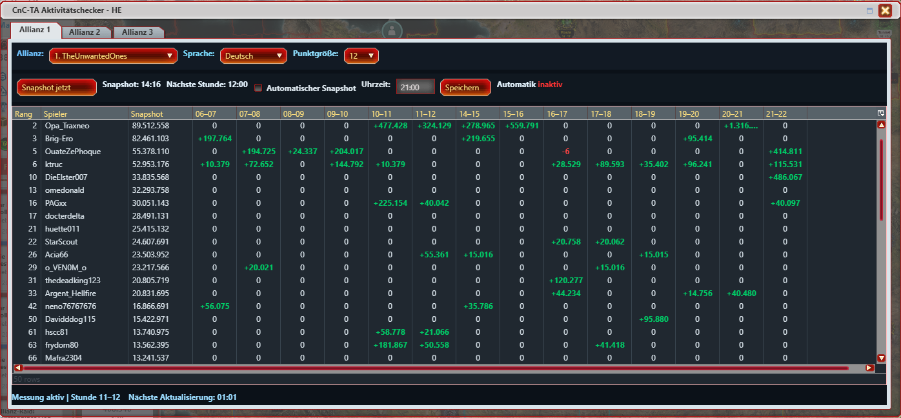

# CnC-TA Aktivitätschecker - HE

Ein Aktivitätschecker für **Command & Conquer: Tiberium Alliances**.

Das Script überwacht die Punkteentwicklung von Spielern einer ausgewählten Allianz und stellt die Aktivität übersichtlich in einem stundenbasierten Dashboard dar.



---

## Funktionen

- Übersicht der **Top-25-Allianzen**
- Auswahl einer Allianz pro Reiter
- Bis zu **3 gleichzeitig überwachte Allianzen**
- Erfassung der Spieler einer ausgewählten Allianz
- Start eines Messzyklus über einen Snapshot
- Ermittlung der **Punkteentwicklung pro Stunde**
- Automatische Aktualisierung der Spielerdaten alle **5 Minuten**
- Erkennung des Wechsels zur nächsten vollen Stunde anhand der **C&C-TA-Serverzeit**
- Anzeige der aktuellen Stunde sowie bereits abgeschlossener Messstunden
- Positive Punkteentwicklung wird **grün** dargestellt
- Negative Punkteentwicklung wird **rot** dargestellt
- Keine Punkteänderung wird neutral dargestellt
- Nicht relevante bzw. noch nicht gemessene Stunden werden ausgeblendet
- Automatischer Snapshot zu einer frei einstellbaren Uhrzeit
- Automatik kann aktiviert/deaktiviert werden
- Automatischer Snapshot ist aktuell nur über **Reiter 1** steuerbar
- Einstellungen und Messdaten werden dauerhaft gespeichert
- Gespeicherte Messdaten werden beim erneuten Öffnen wiederhergestellt
- Individuelle Spaltenbreiten werden gespeichert
- Fenstergröße passt sich an die Anzahl der sichtbaren Stunden an
- Dunkles Dashboard- und Tabellenlayout
- Rang, Spieler und Snapshot bleiben beim horizontalen Scrollen sichtbar
- Einstellbare Schriftgröße der Stundenwerte
- Mehrsprachige Oberfläche

---

## Dashboard

Das Script öffnet ein eigenes Fenster:

**CnC-TA Aktivitätschecker - HE**

Das Dashboard verfügt über drei Reiter.

Jeder Reiter kann unabhängig einer Allianz zugeordnet werden.

Die Allianz wird aus den aktuell verfügbaren Top-25-Allianzen ausgewählt. :contentReference[oaicite:1]{index=1}

### Tabellenaufbau

Die Tabelle enthält:

| Spalte | Beschreibung |
|---|---|
| Rang | Rang des Spielers |
| Spieler | Name des Spielers |
| Snapshot | Ausgangswert des Messzyklus |
| Stunden | Punkteänderung je abgeschlossener Stunde |

Die Stunden werden im Format beispielsweise

`14–15`

`15–16`

`16–17`

angezeigt.

---

## Aktivitätsmessung

Beim Start eines Messzyklus wird ein **Snapshot** der ausgewählten Allianz erstellt.

Dabei werden unter anderem Spielername, Rang, Punkte und Allianz gespeichert. Dieser Snapshot bildet die Ausgangsbasis für die weitere Messung. :contentReference[oaicite:2]{index=2}

Anschließend fragt das Script die Spielerdaten regelmäßig erneut ab.

Die Standard-Aktualisierung erfolgt alle **5 Minuten**. :contentReference[oaicite:3]{index=3}

Die Punkteentwicklung wird anschließend mit dem jeweiligen Stundenreferenzwert verglichen.

Beispiel:

```text
Snapshot       100.000 Punkte

14–15 Uhr      +2.500
15–16 Uhr      +1.800
16–17 Uhr      +0
17–18 Uhr      -500
